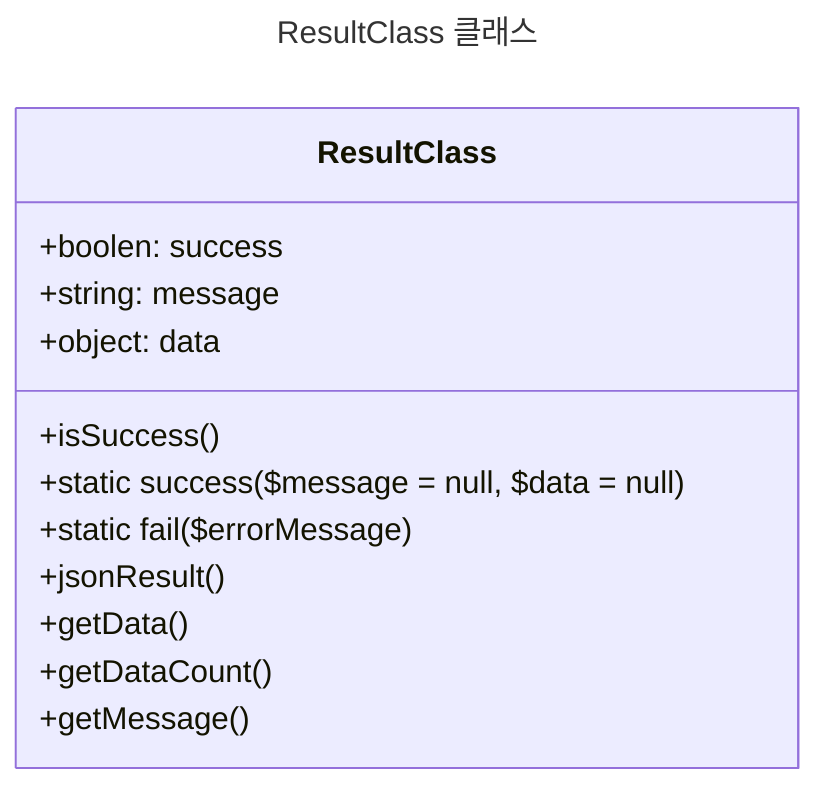

```mermaid
---
title: ResultClass 클래스
---
classDiagram
    class ResultClass{
        +boolen: success
        +string: message
        +object: data
        +isSuccess()
        +static success($message = null, $data = null)
        +static fail($errorMessage)
        +jsonResult()
        +getData()
        +getDataCount()
        +getMessage()
    }
```