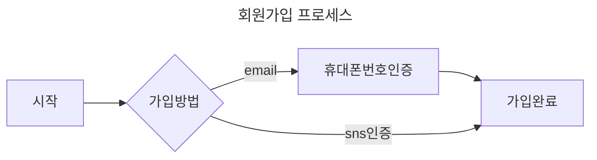
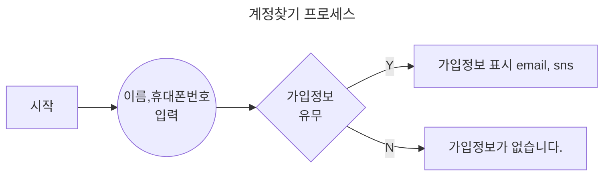
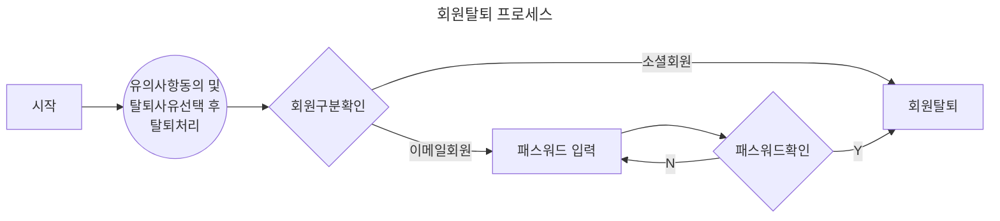

```mermaid
---
title: 회원가입 프로세스
---
flowchart LR
    A[시작] --> B{가입방법}
    B -->|email| C[휴대폰번호인증]
    C --> D[가입완료]
    B -->|sns인증| D
```
---

```mermaid
---
title: 계정찾기 프로세스
---
flowchart LR
    A[시작] --> B((이름,휴대폰번호\n입력))
    B --> C{가입정보\n유무}
    C --> |Y| D[가입정보 표시 email, sns]
    C --> |N| E[가입정보가 없습니다.]
```
---

```mermaid
---
title: 회원탈퇴 프로세스
---
flowchart LR
    A[시작] --> B((유의사항동의 및 \n탈퇴사유선택 후 \n탈퇴처리))
    B --> C{회원구분확인}
    C -->|소셜회원| D[회원탈퇴]
    C -->|이메일회원| E[패스워드 입력]
    E -->F{패스워드확인}
    F -->|Y| D
    F -->|N| E
```
---